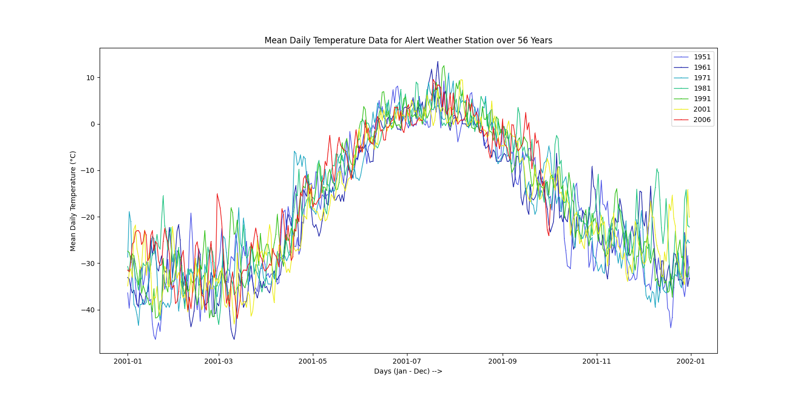

# climate-data-alert-stn

This is a data analysis for the Alert weather station in Nunavut, Canada from 1951 to 2006.  

```
Weather station details
Latitude: 82 North
Longitude: 62 West
Elevation: 30.5 meters
Climate ID: 2400300
```


Summary  


